# GearGuard - Database Schema Design
## Scalable & Robust Database Architecture

---

## 1. Schema Overview

This database schema is designed to be:
- **Scalable**: Supports growth from 100 to 100,000+ equipment records
- **Robust**: Proper constraints, indexes, and data integrity rules
- **Flexible**: Easy to extend with new fields and relationships
- **Auditable**: Track all changes with timestamps and user references

---

## 2. Entity Relationship Diagram

```mermaid
erDiagram
    company ||--o{ department : contains
    company ||--o{ equipment : owns
    company ||--o{ maintenance_team : has
    company ||--o{ maintenance_request : receives
    
    department ||--o{ employee : employs
    department ||--o{ equipment : houses
    
    employee ||--o{ equipment : assigned_to
    employee ||--o{ maintenance_request : creates
    employee ||--o{ maintenance_request : assigned_to
    employee }o--o{ maintenance_team : belongs_to
    
    equipment_category ||--o{ equipment : categorizes
    
    equipment ||--o{ maintenance_request : has
    
    maintenance_team ||--o{ equipment : responsible_for
    maintenance_team ||--o{ maintenance_request : handles
    
    maintenance_request ||--o{ request_history : logs
    maintenance_request ||--o{ maintenance_checklist : contains
    
    equipment ||--o{ equipment_scrap_log : records

    company {
        int id PK
        string name
        string code
        string address
        string city
        string country
        string phone
        string email
        boolean active
        datetime created_at
        datetime updated_at
    }
    
    department {
        int id PK
        string name
        string code
        int company_id FK
        int manager_id FK
        boolean active
        datetime created_at
    }
    
    employee {
        int id PK
        string name
        string email
        string phone
        string employee_code
        int department_id FK
        int company_id FK
        string role
        boolean is_technician
        boolean active
        datetime created_at
    }
    
    equipment_category {
        int id PK
        string name
        string code
        string description
        int parent_id FK
        boolean active
    }
    
    equipment {
        int id PK
        string name
        string serial_number
        int category_id FK
        int department_id FK
        int employee_id FK
        int company_id FK
        int maintenance_team_id FK
        int default_technician_id FK
        string location
        date purchase_date
        decimal purchase_cost
        date warranty_expiry
        text warranty_info
        int health_percentage
        string status
        text notes
        boolean active
        datetime created_at
        datetime updated_at
    }
    
    maintenance_team {
        int id PK
        string name
        string code
        text description
        int team_lead_id FK
        int company_id FK
        string color
        boolean active
        datetime created_at
    }
    
    team_member {
        int id PK
        int team_id FK
        int employee_id FK
        string role
        datetime joined_at
        boolean active
    }
    
    maintenance_request {
        int id PK
        string reference
        string subject
        text description
        string request_type
        string maintenance_for
        int equipment_id FK
        int category_id FK
        int team_id FK
        int technician_id FK
        int created_by FK
        int company_id FK
        date request_date
        datetime scheduled_date
        datetime started_at
        datetime completed_at
        decimal duration_hours
        string stage
        int priority
        boolean is_overdue
        text notes
        text instructions
        datetime created_at
        datetime updated_at
    }
    
    request_history {
        int id PK
        int request_id FK
        string from_stage
        string to_stage
        int changed_by FK
        text comment
        datetime changed_at
    }
    
    equipment_scrap_log {
        int id PK
        int equipment_id FK
        int request_id FK
        int scrapped_by FK
        text reason
        datetime scrapped_at
    }
    
    maintenance_checklist {
        int id PK
        int request_id FK
        string task_name
        text description
        boolean is_completed
        int completed_by FK
        datetime completed_at
        int sequence
    }
```



---

## 3. Detailed Table Definitions

### 3.1 Company Table
**Purpose**: Multi-company support for enterprise deployments

```sql
CREATE TABLE company (
    id              SERIAL PRIMARY KEY,
    name            VARCHAR(255) NOT NULL,
    code            VARCHAR(50) UNIQUE,
    address         TEXT,
    city            VARCHAR(100),
    country         VARCHAR(100),
    phone           VARCHAR(50),
    email           VARCHAR(255),
    logo            BYTEA,                          -- Company logo
    active          BOOLEAN DEFAULT TRUE,
    created_at      TIMESTAMP DEFAULT CURRENT_TIMESTAMP,
    updated_at      TIMESTAMP DEFAULT CURRENT_TIMESTAMP
);

-- Indexes
CREATE INDEX idx_company_active ON company(active);
CREATE INDEX idx_company_name ON company(name);
```

| Field | Type | Constraints | Description |
|-------|------|-------------|-------------|
| id | SERIAL | PK | Auto-increment primary key |
| name | VARCHAR(255) | NOT NULL | Company display name |
| code | VARCHAR(50) | UNIQUE | Short code (e.g., "MYSF") |
| address | TEXT | | Full street address |
| city | VARCHAR(100) | | City name |
| country | VARCHAR(100) | | Country name |
| phone | VARCHAR(50) | | Contact phone |
| email | VARCHAR(255) | | Contact email |
| logo | BYTEA | | Binary logo image |
| active | BOOLEAN | DEFAULT TRUE | Soft delete flag |
| created_at | TIMESTAMP | DEFAULT NOW | Record creation time |
| updated_at | TIMESTAMP | DEFAULT NOW | Last update time |

---

### 3.2 Department Table
**Purpose**: Organizational structure for equipment grouping

```sql
CREATE TABLE department (
    id              SERIAL PRIMARY KEY,
    name            VARCHAR(255) NOT NULL,
    code            VARCHAR(50),
    company_id      INTEGER NOT NULL REFERENCES company(id) ON DELETE CASCADE,
    manager_id      INTEGER REFERENCES employee(id) ON DELETE SET NULL,
    parent_id       INTEGER REFERENCES department(id) ON DELETE SET NULL,
    active          BOOLEAN DEFAULT TRUE,
    created_at      TIMESTAMP DEFAULT CURRENT_TIMESTAMP,
    
    UNIQUE(company_id, code)
);

-- Indexes
CREATE INDEX idx_department_company ON department(company_id);
CREATE INDEX idx_department_active ON department(active);
```

| Field | Type | Constraints | Description |
|-------|------|-------------|-------------|
| id | SERIAL | PK | Auto-increment primary key |
| name | VARCHAR(255) | NOT NULL | Department name (e.g., "Production", "IT") |
| code | VARCHAR(50) | UNIQUE per company | Short code |
| company_id | INTEGER | FK → company | Parent company |
| manager_id | INTEGER | FK → employee | Department head |
| parent_id | INTEGER | FK → department | For hierarchical departments |
| active | BOOLEAN | DEFAULT TRUE | Soft delete flag |

---

### 3.3 Employee Table
**Purpose**: Users who can create requests, be technicians, or managers

```sql
CREATE TABLE employee (
    id              SERIAL PRIMARY KEY,
    name            VARCHAR(255) NOT NULL,
    email           VARCHAR(255) UNIQUE NOT NULL,
    phone           VARCHAR(50),
    employee_code   VARCHAR(50),
    department_id   INTEGER REFERENCES department(id) ON DELETE SET NULL,
    company_id      INTEGER NOT NULL REFERENCES company(id) ON DELETE CASCADE,
    job_title       VARCHAR(255),
    role            VARCHAR(50) DEFAULT 'user',     -- 'user', 'technician', 'manager', 'admin'
    is_technician   BOOLEAN DEFAULT FALSE,
    avatar          BYTEA,                          -- Profile picture for Kanban
    active          BOOLEAN DEFAULT TRUE,
    created_at      TIMESTAMP DEFAULT CURRENT_TIMESTAMP,
    updated_at      TIMESTAMP DEFAULT CURRENT_TIMESTAMP,
    
    UNIQUE(company_id, employee_code)
);

-- Indexes
CREATE INDEX idx_employee_company ON employee(company_id);
CREATE INDEX idx_employee_department ON employee(department_id);
CREATE INDEX idx_employee_technician ON employee(is_technician) WHERE is_technician = TRUE;
CREATE INDEX idx_employee_active ON employee(active);
CREATE INDEX idx_employee_email ON employee(email);
```

| Field | Type | Constraints | Description |
|-------|------|-------------|-------------|
| id | SERIAL | PK | Auto-increment primary key |
| name | VARCHAR(255) | NOT NULL | Full name (e.g., "Mitchell Admin") |
| email | VARCHAR(255) | UNIQUE, NOT NULL | Login email |
| phone | VARCHAR(50) | | Contact phone |
| employee_code | VARCHAR(50) | UNIQUE per company | Employee ID |
| department_id | INTEGER | FK → department | Assigned department |
| company_id | INTEGER | FK → company | Employer |
| job_title | VARCHAR(255) | | Position title |
| role | VARCHAR(50) | DEFAULT 'user' | Access level |
| is_technician | BOOLEAN | DEFAULT FALSE | Can be assigned to requests |
| avatar | BYTEA | | Profile image for Kanban cards |
| active | BOOLEAN | DEFAULT TRUE | Soft delete flag |

---

### 3.4 Equipment Category Table
**Purpose**: Hierarchical categorization of equipment types

```sql
CREATE TABLE equipment_category (
    id              SERIAL PRIMARY KEY,
    name            VARCHAR(255) NOT NULL,
    code            VARCHAR(50) UNIQUE,
    description     TEXT,
    parent_id       INTEGER REFERENCES equipment_category(id) ON DELETE SET NULL,
    icon            VARCHAR(50),                    -- Icon class name
    color           VARCHAR(20),                    -- Hex color for UI
    active          BOOLEAN DEFAULT TRUE,
    created_at      TIMESTAMP DEFAULT CURRENT_TIMESTAMP
);

-- Indexes
CREATE INDEX idx_category_parent ON equipment_category(parent_id);
CREATE INDEX idx_category_active ON equipment_category(active);
```

| Field | Type | Constraints | Description |
|-------|------|-------------|-------------|
| id | SERIAL | PK | Auto-increment primary key |
| name | VARCHAR(255) | NOT NULL | Category name (e.g., "Computers", "Monitors") |
| code | VARCHAR(50) | UNIQUE | Short code (e.g., "COMP", "MON") |
| description | TEXT | | Category description |
| parent_id | INTEGER | FK → self | For hierarchical categories |
| icon | VARCHAR(50) | | UI icon class |
| color | VARCHAR(20) | | UI color code |
| active | BOOLEAN | DEFAULT TRUE | Soft delete flag |

---

### 3.5 Equipment Table ⭐
**Purpose**: Central asset registry - CORE TABLE

```sql
CREATE TABLE equipment (
    id                      SERIAL PRIMARY KEY,
    name                    VARCHAR(255) NOT NULL,
    serial_number           VARCHAR(100) NOT NULL,
    reference               VARCHAR(100),           -- Display reference like "LP/203/19281928"
    category_id             INTEGER REFERENCES equipment_category(id) ON DELETE SET NULL,
    department_id           INTEGER REFERENCES department(id) ON DELETE SET NULL,
    employee_id             INTEGER REFERENCES employee(id) ON DELETE SET NULL,
    company_id              INTEGER NOT NULL REFERENCES company(id) ON DELETE CASCADE,
    maintenance_team_id     INTEGER REFERENCES maintenance_team(id) ON DELETE SET NULL,
    default_technician_id   INTEGER REFERENCES employee(id) ON DELETE SET NULL,
    
    -- Location
    location                VARCHAR(255),
    building                VARCHAR(100),
    floor                   VARCHAR(50),
    room                    VARCHAR(50),
    
    -- Financial
    purchase_date           DATE,
    purchase_cost           DECIMAL(15, 2),
    currency                VARCHAR(3) DEFAULT 'USD',
    vendor                  VARCHAR(255),
    
    -- Warranty
    warranty_expiry         DATE,
    warranty_info           TEXT,
    
    -- Health & Status
    health_percentage       INTEGER DEFAULT 100 CHECK (health_percentage >= 0 AND health_percentage <= 100),
    status                  VARCHAR(50) DEFAULT 'active',  -- 'active', 'maintenance', 'scrapped', 'retired'
    is_critical             BOOLEAN GENERATED ALWAYS AS (health_percentage < 30) STORED,
    
    -- Metadata
    notes                   TEXT,
    image                   BYTEA,
    active                  BOOLEAN DEFAULT TRUE,
    created_at              TIMESTAMP DEFAULT CURRENT_TIMESTAMP,
    updated_at              TIMESTAMP DEFAULT CURRENT_TIMESTAMP,
    
    UNIQUE(company_id, serial_number)
);

-- Indexes for performance
CREATE INDEX idx_equipment_company ON equipment(company_id);
CREATE INDEX idx_equipment_category ON equipment(category_id);
CREATE INDEX idx_equipment_department ON equipment(department_id);
CREATE INDEX idx_equipment_employee ON equipment(employee_id);
CREATE INDEX idx_equipment_team ON equipment(maintenance_team_id);
CREATE INDEX idx_equipment_status ON equipment(status);
CREATE INDEX idx_equipment_health ON equipment(health_percentage);
CREATE INDEX idx_equipment_critical ON equipment(is_critical) WHERE is_critical = TRUE;
CREATE INDEX idx_equipment_active ON equipment(active);
CREATE INDEX idx_equipment_serial ON equipment(serial_number);

-- Full text search on name
CREATE INDEX idx_equipment_name_search ON equipment USING gin(to_tsvector('english', name));
```

| Field | Type | Constraints | Description |
|-------|------|-------------|-------------|
| id | SERIAL | PK | Auto-increment primary key |
| name | VARCHAR(255) | NOT NULL | Equipment name (e.g., "Acer Laptop") |
| serial_number | VARCHAR(100) | NOT NULL, UNIQUE/company | Manufacturer serial |
| reference | VARCHAR(100) | | Display ref (e.g., "LP/203/19281928") |
| category_id | INTEGER | FK → equipment_category | Type classification |
| department_id | INTEGER | FK → department | Owning department |
| employee_id | INTEGER | FK → employee | Assigned person |
| company_id | INTEGER | FK → company, NOT NULL | Owner company |
| maintenance_team_id | INTEGER | FK → maintenance_team | Default repair team |
| default_technician_id | INTEGER | FK → employee | Default assignee |
| location | VARCHAR(255) | | Physical location |
| building | VARCHAR(100) | | Building name/number |
| floor | VARCHAR(50) | | Floor level |
| room | VARCHAR(50) | | Room number |
| purchase_date | DATE | | Acquisition date |
| purchase_cost | DECIMAL(15,2) | | Purchase price |
| currency | VARCHAR(3) | DEFAULT 'USD' | Cost currency |
| vendor | VARCHAR(255) | | Supplier name |
| warranty_expiry | DATE | | Warranty end date |
| warranty_info | TEXT | | Warranty terms |
| **health_percentage** | INTEGER | 0-100, DEFAULT 100 | Current health % |
| status | VARCHAR(50) | DEFAULT 'active' | Current status |
| **is_critical** | BOOLEAN | GENERATED | Auto-computed (health < 30) |
| notes | TEXT | | General notes |
| image | BYTEA | | Equipment photo |
| active | BOOLEAN | DEFAULT TRUE | Soft delete flag |

> [!IMPORTANT]
> The `is_critical` field is **auto-computed** based on health_percentage < 30% for dashboard KPI

---

### 3.6 Maintenance Team Table
**Purpose**: Specialized repair groups

```sql
CREATE TABLE maintenance_team (
    id              SERIAL PRIMARY KEY,
    name            VARCHAR(255) NOT NULL,
    code            VARCHAR(50),
    description     TEXT,
    team_lead_id    INTEGER REFERENCES employee(id) ON DELETE SET NULL,
    company_id      INTEGER NOT NULL REFERENCES company(id) ON DELETE CASCADE,
    color           VARCHAR(20) DEFAULT '#3498db',  -- Team color for UI
    email           VARCHAR(255),                   -- Team email
    active          BOOLEAN DEFAULT TRUE,
    created_at      TIMESTAMP DEFAULT CURRENT_TIMESTAMP,
    updated_at      TIMESTAMP DEFAULT CURRENT_TIMESTAMP,
    
    UNIQUE(company_id, code)
);

-- Indexes
CREATE INDEX idx_team_company ON maintenance_team(company_id);
CREATE INDEX idx_team_active ON maintenance_team(active);
CREATE INDEX idx_team_lead ON maintenance_team(team_lead_id);
```

| Field | Type | Constraints | Description |
|-------|------|-------------|-------------|
| id | SERIAL | PK | Auto-increment primary key |
| name | VARCHAR(255) | NOT NULL | Team name (e.g., "Internal Maintenance") |
| code | VARCHAR(50) | UNIQUE per company | Short code |
| description | TEXT | | Team responsibilities |
| team_lead_id | INTEGER | FK → employee | Team manager |
| company_id | INTEGER | FK → company | Owner company |
| color | VARCHAR(20) | DEFAULT blue | UI display color |
| email | VARCHAR(255) | | Team contact email |
| active | BOOLEAN | DEFAULT TRUE | Soft delete flag |

---

### 3.7 Team Member Junction Table
**Purpose**: Many-to-many relationship between teams and employees

```sql
CREATE TABLE team_member (
    id              SERIAL PRIMARY KEY,
    team_id         INTEGER NOT NULL REFERENCES maintenance_team(id) ON DELETE CASCADE,
    employee_id     INTEGER NOT NULL REFERENCES employee(id) ON DELETE CASCADE,
    role            VARCHAR(50) DEFAULT 'member',   -- 'lead', 'member', 'backup'
    joined_at       TIMESTAMP DEFAULT CURRENT_TIMESTAMP,
    active          BOOLEAN DEFAULT TRUE,
    
    UNIQUE(team_id, employee_id)
);

-- Indexes
CREATE INDEX idx_team_member_team ON team_member(team_id);
CREATE INDEX idx_team_member_employee ON team_member(employee_id);
CREATE INDEX idx_team_member_active ON team_member(active);
```

| Field | Type | Constraints | Description |
|-------|------|-------------|-------------|
| id | SERIAL | PK | Auto-increment primary key |
| team_id | INTEGER | FK → maintenance_team | Team reference |
| employee_id | INTEGER | FK → employee | Member reference |
| role | VARCHAR(50) | DEFAULT 'member' | Role in team |
| joined_at | TIMESTAMP | DEFAULT NOW | When joined |
| active | BOOLEAN | DEFAULT TRUE | Active membership |

---

### 3.8 Maintenance Request Table ⭐
**Purpose**: Work order tracking - CORE TRANSACTIONAL TABLE

```sql
CREATE TABLE maintenance_request (
    id                  SERIAL PRIMARY KEY,
    reference           VARCHAR(50) NOT NULL,       -- Auto-generated: MR/2024/00001
    subject             VARCHAR(500) NOT NULL,
    description         TEXT,
    
    -- Type & Classification
    request_type        VARCHAR(20) NOT NULL CHECK (request_type IN ('corrective', 'preventive')),
    maintenance_for     VARCHAR(50) DEFAULT 'equipment',  -- 'equipment', 'facility', 'other'
    
    -- Relationships
    equipment_id        INTEGER REFERENCES equipment(id) ON DELETE SET NULL,
    category_id         INTEGER REFERENCES equipment_category(id) ON DELETE SET NULL,
    team_id             INTEGER REFERENCES maintenance_team(id) ON DELETE SET NULL,
    technician_id       INTEGER REFERENCES employee(id) ON DELETE SET NULL,
    created_by          INTEGER NOT NULL REFERENCES employee(id) ON DELETE RESTRICT,
    company_id          INTEGER NOT NULL REFERENCES company(id) ON DELETE CASCADE,
    
    -- Dates & Time
    request_date        DATE NOT NULL DEFAULT CURRENT_DATE,
    scheduled_date      TIMESTAMP,
    started_at          TIMESTAMP,
    completed_at        TIMESTAMP,
    duration_hours      DECIMAL(10, 2) DEFAULT 0,
    
    -- Status
    stage               VARCHAR(20) NOT NULL DEFAULT 'new' 
                        CHECK (stage IN ('new', 'in_progress', 'repaired', 'scrap')),
    priority            INTEGER DEFAULT 1 CHECK (priority >= 1 AND priority <= 5),  -- 1=Low, 5=Urgent
    
    -- Computed Fields
    is_overdue          BOOLEAN GENERATED ALWAYS AS (
                            scheduled_date IS NOT NULL 
                            AND scheduled_date < CURRENT_TIMESTAMP 
                            AND stage NOT IN ('repaired', 'scrap')
                        ) STORED,
    
    -- Content
    notes               TEXT,
    instructions        TEXT,
    
    -- Metadata
    active              BOOLEAN DEFAULT TRUE,
    created_at          TIMESTAMP DEFAULT CURRENT_TIMESTAMP,
    updated_at          TIMESTAMP DEFAULT CURRENT_TIMESTAMP
);

-- Auto-generate reference number
CREATE OR REPLACE FUNCTION generate_request_reference()
RETURNS TRIGGER AS $$
BEGIN
    NEW.reference := 'MR/' || TO_CHAR(CURRENT_DATE, 'YYYY') || '/' || 
                     LPAD(CAST(nextval('maintenance_request_seq') AS VARCHAR), 5, '0');
    RETURN NEW;
END;
$$ LANGUAGE plpgsql;

CREATE SEQUENCE maintenance_request_seq START 1;
CREATE TRIGGER trg_request_reference
    BEFORE INSERT ON maintenance_request
    FOR EACH ROW
    EXECUTE FUNCTION generate_request_reference();

-- Indexes for performance
CREATE INDEX idx_request_company ON maintenance_request(company_id);
CREATE INDEX idx_request_equipment ON maintenance_request(equipment_id);
CREATE INDEX idx_request_team ON maintenance_request(team_id);
CREATE INDEX idx_request_technician ON maintenance_request(technician_id);
CREATE INDEX idx_request_stage ON maintenance_request(stage);
CREATE INDEX idx_request_type ON maintenance_request(request_type);
CREATE INDEX idx_request_scheduled ON maintenance_request(scheduled_date);
CREATE INDEX idx_request_overdue ON maintenance_request(is_overdue) WHERE is_overdue = TRUE;
CREATE INDEX idx_request_created_by ON maintenance_request(created_by);
CREATE INDEX idx_request_active ON maintenance_request(active);

-- Composite index for Kanban grouping
CREATE INDEX idx_request_stage_team ON maintenance_request(stage, team_id);

-- Index for calendar view (preventive requests by date)
CREATE INDEX idx_request_calendar ON maintenance_request(scheduled_date, request_type) 
    WHERE request_type = 'preventive';
```

| Field | Type | Constraints | Description |
|-------|------|-------------|-------------|
| id | SERIAL | PK | Auto-increment primary key |
| **reference** | VARCHAR(50) | NOT NULL, AUTO | Display ref (MR/2024/00001) |
| subject | VARCHAR(500) | NOT NULL | Issue description |
| description | TEXT | | Detailed description |
| **request_type** | VARCHAR(20) | CHECK constraint | 'corrective' or 'preventive' |
| maintenance_for | VARCHAR(50) | DEFAULT 'equipment' | What needs maintenance |
| equipment_id | INTEGER | FK → equipment | Affected equipment |
| category_id | INTEGER | FK → equipment_category | Auto-filled from equipment |
| team_id | INTEGER | FK → maintenance_team | Responsible team |
| technician_id | INTEGER | FK → employee | Assigned technician |
| created_by | INTEGER | FK → employee | Request creator |
| company_id | INTEGER | FK → company | Owner company |
| request_date | DATE | DEFAULT TODAY | Creation date |
| scheduled_date | TIMESTAMP | | Planned work date/time |
| started_at | TIMESTAMP | | When work began |
| completed_at | TIMESTAMP | | When work finished |
| **duration_hours** | DECIMAL(10,2) | DEFAULT 0 | Hours spent |
| **stage** | VARCHAR(20) | CHECK constraint | new/in_progress/repaired/scrap |
| priority | INTEGER | 1-5 | Request urgency |
| **is_overdue** | BOOLEAN | GENERATED | Auto-computed |
| notes | TEXT | | Notes tab content |
| instructions | TEXT | | Instructions tab content |

> [!IMPORTANT]
> - `is_overdue` is **auto-computed** for dashboard KPI
> - `reference` is **auto-generated** using trigger

---

### 3.9 Request History Table
**Purpose**: Audit trail for stage transitions

```sql
CREATE TABLE request_history (
    id              SERIAL PRIMARY KEY,
    request_id      INTEGER NOT NULL REFERENCES maintenance_request(id) ON DELETE CASCADE,
    from_stage      VARCHAR(20),
    to_stage        VARCHAR(20) NOT NULL,
    changed_by      INTEGER NOT NULL REFERENCES employee(id) ON DELETE RESTRICT,
    comment         TEXT,
    duration_at_change DECIMAL(10, 2),             -- Duration when stage changed
    changed_at      TIMESTAMP DEFAULT CURRENT_TIMESTAMP
);

-- Indexes
CREATE INDEX idx_history_request ON request_history(request_id);
CREATE INDEX idx_history_changed_at ON request_history(changed_at);
```

| Field | Type | Description |
|-------|------|-------------|
| id | SERIAL | Primary key |
| request_id | INTEGER | FK → maintenance_request |
| from_stage | VARCHAR(20) | Previous stage |
| to_stage | VARCHAR(20) | New stage |
| changed_by | INTEGER | FK → employee |
| comment | TEXT | Transition note |
| duration_at_change | DECIMAL | Hours at transition |
| changed_at | TIMESTAMP | When changed |

---

### 3.10 Equipment Scrap Log Table
**Purpose**: Records equipment decommissioning

```sql
CREATE TABLE equipment_scrap_log (
    id              SERIAL PRIMARY KEY,
    equipment_id    INTEGER NOT NULL REFERENCES equipment(id) ON DELETE CASCADE,
    request_id      INTEGER REFERENCES maintenance_request(id) ON DELETE SET NULL,
    scrapped_by     INTEGER NOT NULL REFERENCES employee(id) ON DELETE RESTRICT,
    reason          TEXT NOT NULL,
    scrap_value     DECIMAL(15, 2),                -- Salvage value if any
    disposal_method VARCHAR(100),                   -- How it was disposed
    scrapped_at     TIMESTAMP DEFAULT CURRENT_TIMESTAMP
);

-- Indexes
CREATE INDEX idx_scrap_equipment ON equipment_scrap_log(equipment_id);
CREATE INDEX idx_scrap_request ON equipment_scrap_log(request_id);
CREATE INDEX idx_scrap_date ON equipment_scrap_log(scrapped_at);
```

| Field | Type | Description |
|-------|------|-------------|
| id | SERIAL | Primary key |
| equipment_id | INTEGER | FK → equipment |
| request_id | INTEGER | FK → maintenance_request (trigger) |
| scrapped_by | INTEGER | FK → employee |
| reason | TEXT | Why scrapped |
| scrap_value | DECIMAL | Salvage value |
| disposal_method | VARCHAR | How disposed |
| scrapped_at | TIMESTAMP | When scrapped |

---

### 3.11 Maintenance Checklist Table
**Purpose**: Step-by-step task tracking for requests

```sql
CREATE TABLE maintenance_checklist (
    id              SERIAL PRIMARY KEY,
    request_id      INTEGER NOT NULL REFERENCES maintenance_request(id) ON DELETE CASCADE,
    task_name       VARCHAR(500) NOT NULL,
    description     TEXT,
    is_completed    BOOLEAN DEFAULT FALSE,
    completed_by    INTEGER REFERENCES employee(id) ON DELETE SET NULL,
    completed_at    TIMESTAMP,
    sequence        INTEGER DEFAULT 0,              -- Order of tasks
    created_at      TIMESTAMP DEFAULT CURRENT_TIMESTAMP
);

-- Indexes
CREATE INDEX idx_checklist_request ON maintenance_checklist(request_id);
CREATE INDEX idx_checklist_sequence ON maintenance_checklist(request_id, sequence);
```

| Field | Type | Description |
|-------|------|-------------|
| id | SERIAL | Primary key |
| request_id | INTEGER | FK → maintenance_request |
| task_name | VARCHAR(500) | Task description |
| description | TEXT | Detailed instructions |
| is_completed | BOOLEAN | Completion status |
| completed_by | INTEGER | Who completed |
| completed_at | TIMESTAMP | When completed |
| sequence | INTEGER | Display order |

---

## 4. Triggers & Stored Procedures

### 4.1 Auto-Update Equipment on Scrap

```sql
CREATE OR REPLACE FUNCTION handle_scrap_stage()
RETURNS TRIGGER AS $$
BEGIN
    IF NEW.stage = 'scrap' AND OLD.stage != 'scrap' AND NEW.equipment_id IS NOT NULL THEN
        -- Update equipment status
        UPDATE equipment 
        SET status = 'scrapped', 
            active = FALSE,
            updated_at = CURRENT_TIMESTAMP
        WHERE id = NEW.equipment_id;
        
        -- Create scrap log
        INSERT INTO equipment_scrap_log (equipment_id, request_id, scrapped_by, reason)
        VALUES (NEW.equipment_id, NEW.id, NEW.technician_id, 
                'Scrapped via maintenance request: ' || NEW.subject);
    END IF;
    RETURN NEW;
END;
$$ LANGUAGE plpgsql;

CREATE TRIGGER trg_handle_scrap
    AFTER UPDATE ON maintenance_request
    FOR EACH ROW
    WHEN (NEW.stage = 'scrap' AND OLD.stage != 'scrap')
    EXECUTE FUNCTION handle_scrap_stage();
```

### 4.2 Log Stage Transitions

```sql
CREATE OR REPLACE FUNCTION log_stage_change()
RETURNS TRIGGER AS $$
BEGIN
    IF OLD.stage IS DISTINCT FROM NEW.stage THEN
        INSERT INTO request_history (request_id, from_stage, to_stage, changed_by, duration_at_change)
        VALUES (NEW.id, OLD.stage, NEW.stage, 
                COALESCE(NEW.technician_id, NEW.created_by), 
                NEW.duration_hours);
    END IF;
    RETURN NEW;
END;
$$ LANGUAGE plpgsql;

CREATE TRIGGER trg_log_stage
    AFTER UPDATE ON maintenance_request
    FOR EACH ROW
    EXECUTE FUNCTION log_stage_change();
```

### 4.3 Auto-Fill Category from Equipment

```sql
CREATE OR REPLACE FUNCTION autofill_from_equipment()
RETURNS TRIGGER AS $$
DECLARE
    equip equipment%ROWTYPE;
BEGIN
    IF NEW.equipment_id IS NOT NULL THEN
        SELECT * INTO equip FROM equipment WHERE id = NEW.equipment_id;
        
        -- Auto-fill if not already set
        NEW.category_id := COALESCE(NEW.category_id, equip.category_id);
        NEW.team_id := COALESCE(NEW.team_id, equip.maintenance_team_id);
        NEW.technician_id := COALESCE(NEW.technician_id, equip.default_technician_id);
        NEW.company_id := COALESCE(NEW.company_id, equip.company_id);
    END IF;
    RETURN NEW;
END;
$$ LANGUAGE plpgsql;

CREATE TRIGGER trg_autofill_equipment
    BEFORE INSERT ON maintenance_request
    FOR EACH ROW
    EXECUTE FUNCTION autofill_from_equipment();
```

---

## 5. Views for Dashboard & Reports

### 5.1 Dashboard KPIs View

```sql
CREATE VIEW v_dashboard_kpis AS
SELECT 
    c.id AS company_id,
    c.name AS company_name,
    
    -- Critical Equipment Count
    (SELECT COUNT(*) FROM equipment e 
     WHERE e.company_id = c.id AND e.is_critical = TRUE AND e.active = TRUE) AS critical_equipment_count,
    
    -- Open Requests Count
    (SELECT COUNT(*) FROM maintenance_request r 
     WHERE r.company_id = c.id AND r.stage IN ('new', 'in_progress') AND r.active = TRUE) AS open_requests_count,
    
    -- Overdue Requests Count
    (SELECT COUNT(*) FROM maintenance_request r 
     WHERE r.company_id = c.id AND r.is_overdue = TRUE AND r.active = TRUE) AS overdue_requests_count,
    
    -- Technician Utilization (simplified)
    (SELECT 
        CASE 
            WHEN COUNT(DISTINCT e.id) = 0 THEN 0
            ELSE ROUND(100.0 * COUNT(DISTINCT r.technician_id) / COUNT(DISTINCT e.id), 1)
        END
     FROM employee e
     LEFT JOIN maintenance_request r ON r.technician_id = e.id 
         AND r.stage = 'in_progress' AND r.active = TRUE
     WHERE e.company_id = c.id AND e.is_technician = TRUE AND e.active = TRUE
    ) AS technician_utilization_pct

FROM company c
WHERE c.active = TRUE;
```

### 5.2 Equipment Health Summary View

```sql
CREATE VIEW v_equipment_health_summary AS
SELECT 
    e.id,
    e.name,
    e.serial_number,
    e.health_percentage,
    e.status,
    e.is_critical,
    ec.name AS category_name,
    d.name AS department_name,
    emp.name AS assigned_to,
    mt.name AS maintenance_team,
    c.name AS company_name,
    (SELECT COUNT(*) FROM maintenance_request r 
     WHERE r.equipment_id = e.id AND r.stage IN ('new', 'in_progress')) AS open_request_count
FROM equipment e
LEFT JOIN equipment_category ec ON e.category_id = ec.id
LEFT JOIN department d ON e.department_id = d.id
LEFT JOIN employee emp ON e.employee_id = emp.id
LEFT JOIN maintenance_team mt ON e.maintenance_team_id = mt.id
LEFT JOIN company c ON e.company_id = c.id
WHERE e.active = TRUE;
```

### 5.3 Requests by Team Report View

```sql
CREATE VIEW v_requests_by_team AS
SELECT 
    mt.id AS team_id,
    mt.name AS team_name,
    mt.company_id,
    r.stage,
    r.request_type,
    COUNT(*) AS request_count,
    AVG(r.duration_hours) AS avg_duration_hours
FROM maintenance_request r
JOIN maintenance_team mt ON r.team_id = mt.id
WHERE r.active = TRUE
GROUP BY mt.id, mt.name, mt.company_id, r.stage, r.request_type;
```

---

## 6. Indexing Strategy Summary

| Table | Index Type | Columns | Purpose |
|-------|------------|---------|---------|
| equipment | B-tree | company_id | Company filter |
| equipment | B-tree | health_percentage | Health queries |
| equipment | Partial | is_critical (WHERE TRUE) | Dashboard KPI |
| equipment | GIN | name (full-text) | Search |
| maintenance_request | B-tree | stage | Kanban grouping |
| maintenance_request | B-tree | scheduled_date | Calendar view |
| maintenance_request | Partial | is_overdue (WHERE TRUE) | Dashboard KPI |
| maintenance_request | Composite | (stage, team_id) | Kanban + filter |

---

## 7. Scalability Considerations

### Partitioning (For Large Datasets)
```sql
-- Partition maintenance_request by year for historical data
CREATE TABLE maintenance_request (
    -- ... columns ...
) PARTITION BY RANGE (created_at);

CREATE TABLE maintenance_request_2024 
    PARTITION OF maintenance_request 
    FOR VALUES FROM ('2024-01-01') TO ('2025-01-01');

CREATE TABLE maintenance_request_2025 
    PARTITION OF maintenance_request 
    FOR VALUES FROM ('2025-01-01') TO ('2026-01-01');
```

### Connection Pooling
- Use PgBouncer or built-in pooling
- Configure `max_connections` appropriately

### Read Replicas
- Use read replicas for dashboard and reporting queries
- Write operations only on primary

---

## 8. Security Recommendations

1. **Row-Level Security (RLS)** for multi-tenant access
2. **Encrypted columns** for sensitive data
3. **Audit logging** via triggers
4. **Role-based access** with PostgreSQL roles

```sql
-- Example RLS policy
ALTER TABLE equipment ENABLE ROW LEVEL SECURITY;

CREATE POLICY equipment_company_isolation ON equipment
    USING (company_id = current_setting('app.current_company_id')::INTEGER);
```

---

*Schema Version: 1.0*  
*Created: December 27, 2024*  
*Database: PostgreSQL 14+*  
*Project: GearGuard - ODOO x Adani Hackathon*
