# GearGuard - The Ultimate Maintenance Tracker
## Comprehensive System Analysis & Requirements Document

---

## 1. Executive Summary

**GearGuard** is an ERP-style maintenance management system designed to help companies efficiently track their assets (machines, vehicles, computers) and manage maintenance requests throughout their lifecycle.

### Core Philosophy
The module must seamlessly connect three pillars:
1. **Equipment** → What is broken?
2. **Teams** → Who fixes it?
3. **Requests** → What work needs to be done?

---

## 2. System Architecture Overview

```mermaid
flowchart TD
    subgraph Core["🏗️ Core Entities"]
        E[Equipment]
        T[Maintenance Teams]
        R[Maintenance Requests]
    end
    
    subgraph Users["👥 User Roles"]
        U1[Any User - Request Creator]
        U2[Manager - Scheduler/Assigner]
        U3[Technician - Executor]
    end
    
    E --> R
    T --> R
    T --> U3
    U1 --> R
    U2 --> R
    U3 --> R
    
    style E fill:#4CAF50,color:#fff
    style T fill:#2196F3,color:#fff
    style R fill:#FF9800,color:#fff
```



---

## 3. Key Functional Areas

### A. Equipment Management 📦

The system serves as a **central database** for all company assets with comprehensive tracking capabilities.

#### Equipment Tracking Dimensions

| Tracking Type | Description | Example |
|---------------|-------------|---------|
| **By Department** | Assets categorized by organizational unit | CNC Machine → "Production" dept |
| **By Employee** | Assets assigned to specific persons | Laptop → "John Doe" |

#### Responsibility Assignment
- Each equipment **MUST** have a dedicated **Maintenance Team** assigned
- A **default technician** should be pre-assigned to each equipment

#### Required Fields (From Excalidraw Flow)

| Field | Type | Description | Required |
|-------|------|-------------|----------|
| Equipment Name | Text | Display name (e.g., "Samsung Monitor 15\"", "Acer Laptop") | ✅ |
| Serial Number | Text (Unique) | Unique ID format: MT/XXX/XXXXXXXX | ✅ |
| Employee | Many2One | Assigned user (e.g., "Tejas Modi", "Bhaumik P") | ✅ |
| Department | Many2One | Department (e.g., "Admin", "Technician") | ✅ |
| Technician | Many2One | Default technician for repairs | ✅ |
| Equipment Category | Selection/Many2One | Classification (e.g., "Monitors", "Computers") | ✅ |
| Company | Many2One | Company (e.g., "My Company (San Francisco)") | ✅ |
| Location | Text | Physical location of equipment | ⚠️ Optional |
| Purchase Date | Date | When the asset was acquired | ✅ |
| Warranty Expiry Date | Date | When warranty expires | ⚠️ Optional |
| **Health Percentage** | Integer/Float | Equipment health (0-100%) - Critical if < 30% | ✅ |
| Status | Selection | Active / Under Maintenance / Scrapped | ✅ |

> [!IMPORTANT]
> **Equipment Health Tracking**: Based on the flow diagram, equipment health is tracked as a percentage. Equipment with health < 30% is considered **Critical** and should be flagged in the dashboard.

---

### B. Maintenance Teams 👷

The system must support **multiple specialized teams** with clear boundaries.

#### Team Structure (From Excalidraw Flow)

| Team Name | Example Members |
|-----------|-----------------|
| Internal Maintenance | Anas Makari |
| Metrology | Marc Demo |
| Subcontractor | Maggie Davidson |

#### Required Fields

| Field | Type | Description |
|-------|------|-------------|
| Team Name | Text | Unique identifier (e.g., "Internal Maintenance", "Metrology", "Subcontractor") |
| Team Members | Many2Many | List of technicians/users in this team |
| Company | Many2One | Associated company |

#### Critical Business Logic
> [!IMPORTANT]
> **Workflow Restriction**: When a maintenance request is created for a specific team, **ONLY** members of that team should be able to pick up or be assigned to the request.

---

### C. Maintenance Requests 🔧

This is the **transactional core** of the module, handling the complete lifecycle of repair jobs.

#### Request Types

| Type | Icon | Description | Trigger |
|------|------|-------------|---------|
| **Corrective** | 🚨 | Unplanned repair due to breakdown | Equipment failure |
| **Preventive** | 📅 | Planned routine maintenance/checkup | Scheduled date |

#### Request Stages (From Excalidraw: "New Request > In Progress > Repaired > Scrap")


| Stage | Color Code | Description |
|-------|------------|-------------|
| **New** | 🔵 Blue | Freshly created, awaiting assignment |
| **In Progress** | 🟡 Yellow/Orange | Work is actively being done |
| **Repaired** | 🟢 Green | Successfully fixed |
| **Scrap** | 🔴 Red | Equipment is beyond repair |

#### Required Fields (From Excalidraw Form Layout)

**Left Column (General Info):**
| Field | Type | Description | Required |
|-------|------|-------------|----------|
| Subject | Text | Brief description (e.g., "Test activity") | ✅ |
| Created By | Many2One | User who created request (e.g., "Mitchell Admin") | ✅ (Auto) |
| Maintenance For | Selection | Equipment / Other | ✅ |
| Equipment | Many2One | Link to Equipment record (e.g., "Acer Laptop/LP/203/19281928") | ✅ |
| Category | Selection/Many2One | Auto-filled from Equipment (e.g., "Computers") | ✅ (Auto) |
| Request Date | Date | When request was made | ✅ (Auto) |
| Maintenance Type | Selection | **Corrective** / **Preventive** (radio buttons) | ✅ |

**Right Column (Assignment Info):**
| Field | Type | Description | Required |
|-------|------|-------------|----------|
| Team | Many2One | Maintenance Team (e.g., "Internal Maintenance") | ✅ |
| Technician | Many2One | Assigned person (e.g., "Aka Foster") | ⚠️ Optional initially |
| Scheduled Date | Datetime | When work should happen (e.g., "12/28/2025 14:30:00") | ✅ for Preventive |
| Duration | Float | Time in hours (e.g., "00:00 hours") | ✅ on completion |
| Priority | Star Rating | 3 diamond/star priority indicator | ⚠️ Optional |
| Company | Many2One | Company record | ✅ |

**Tabs Section:**
| Tab | Description |
|-----|-------------|
| **Notes** | General notes about the request |
| **Instructions** | Step-by-step repair instructions |
| **Worksheet** | Opens via Smart Button for detailed work logging |

---

## 4. Dashboard Overview 📊

Based on the Excalidraw flow, the dashboard should include:

### KPI Cards

| Card | Color | Content | Purpose |
|------|-------|---------|---------|
| **Critical Equipment** | 🔴 Red (#fff5f5) | "5 Units (Health < 30%)" | Alert for equipment needing immediate attention |
| **Technician Load** | 🔵 Blue (#e7f5ff) | "85% Utilized (Assign Carefully)" | Workload monitoring |
| **Open Requests** | 🟢 Green (#ebfbee) | "12 Pending, 3 Overdue" | Request queue status |

### Activity List
A table showing recent activities with columns:
- Activity Name
- Assigned User
- Equipment Type
- Status

```
┌────────────────────────────────────────────────────────────────────┐
│  1. Dashboard                                                       │
├───────────────────┬───────────────────┬────────────────────────────┤
│ ┌───────────────┐ │ ┌───────────────┐ │ ┌────────────────────────┐ │
│ │ Critical      │ │ │ Technician    │ │ │ Open Requests          │ │
│ │ Equipment     │ │ │ Load          │ │ │                        │ │
│ │               │ │ │               │ │ │ 12 Pending             │ │
│ │ 5 Units       │ │ │ 85% Utilized  │ │ │ 3 Overdue              │ │
│ │ (Health <30%) │ │ │ (Assign       │ │ │                        │ │
│ │ 🔴 RED        │ │ │ Carefully)    │ │ │ 🟢 GREEN               │ │
│ │               │ │ │ 🔵 BLUE       │ │ │                        │ │
│ └───────────────┘ │ └───────────────┘ │ └────────────────────────┘ │
├───────────────────┴───────────────────┴────────────────────────────┤
│ [New] Activity Table Header                                         │
├────────────────────────────────────────────────────────────────────┤
│ Test activity | Mitchell Admin | Aka Foster | computer | New Req   │
└────────────────────────────────────────────────────────────────────┘
```

---

## 5. Functional Workflows

### Flow 1: The Breakdown (Corrective Maintenance) 🚨


#### Step-by-Step Breakdown

| Step | Actor | Action | System Behavior |
|------|-------|--------|-----------------|
| 1 | Any User | Creates a maintenance request | Form opens with empty fields |
| 2 | Any User | Selects Equipment | **AUTO-FILL**: System fetches and populates Category & Team from Equipment record |
| 3 | System | Sets initial state | Request starts in **"New"** stage |
| 4 | Manager/Tech | Assigns themselves | Technician field is populated |
| 5 | Technician | Starts work | Stage moves to **"In Progress"** |
| 6 | Technician | Completes work | Records **Duration/Hours Spent** |
| 7 | Technician | Marks complete | Stage moves to **"Repaired"** |

---

### Flow 2: The Routine Checkup (Preventive Maintenance) 📅


#### Step-by-Step Breakdown

| Step | Actor | Action | System Behavior |
|------|-------|--------|-----------------|
| 1 | Manager | Creates request with type **"Preventive"** | Form opens |
| 2 | Manager | Sets **Scheduled Date** (datetime) | Date field populated |
| 3 | System | Saves request | Request **appears on Calendar View** on that specific date |
| 4 | Technician | Opens Calendar View | Can see scheduled jobs |
| 5 | Technician | Clicks on request | Can start working on it |

---

## 6. User Interface Requirements

### View 1: Maintenance Kanban Board 📋

**Purpose**: Primary workspace for technicians and managers

#### Specifications

| Feature | Requirement |
|---------|-------------|
| **Grouping** | By Stages: New → In Progress → Repaired → Scrap |
| **Drag & Drop** | Users can drag cards between stages |
| **Card Content** | Subject, Equipment Name, Priority |
| **Technician Avatar** | Display assigned user's profile picture |
| **Overdue Indicator** | 🔴 Red strip/badge if request is past scheduled date |

---

### View 2: Equipment List View 📦

**Purpose**: Central equipment registry

#### Columns (From Excalidraw)
| Column | Description |
|--------|-------------|
| Equipment Name | e.g., "Samsung Monitor 15\"", "Acer Laptop" |
| Employee | Assigned user |
| Department | e.g., "Admin", "Technician" |
| Serial Number | e.g., "MT/122/11112222" |
| Technician | Default technician |
| Equipment Category | e.g., "Monitors", "Computers" |
| Company | e.g., "My Company (San Francisco)" |

> [!NOTE]
> "Equipment List view here one can create, delete and edit the equipment."

---

### View 3: Teams List View 👥

**Purpose**: Team configuration and member management

#### Columns (From Excalidraw)
| Column | Description |
|--------|-------------|
| Team Name | e.g., "Internal Maintenance", "Metrology", "Subcontractor" |
| Team Members | e.g., "Anas Makari", "Marc Demo", "Maggie Davidson" |
| Company | Associated company |

---

### View 4: Calendar View 📆

**Purpose**: Visualize Preventive maintenance schedule

> [!TIP]
> "In calendar scheduled request should be shown"

#### Specifications

| Feature | Requirement |
|---------|-------------|
| **Display** | All **Preventive** maintenance requests |
| **Date Mapping** | Requests appear on their **Scheduled Date** |
| **Quick Create** | Clicking a date opens form to schedule new request |
| **Navigation** | Month/Week/Day views |

---

### View 5: Maintenance Request Form 📝

**Purpose**: Detailed request creation and editing

Based on Excalidraw flow, the form has:

**Header Section:**
- Stage buttons (New | In Progress | Repaired | Scrap)
- Smart Button: Worksheet (opens comment/work logging section)

**Body - Two Column Layout:**

| Left Column | Right Column |
|-------------|--------------|
| Subject (large text) | Team |
| Created By | Technician |
| Maintenance For | Scheduled Date (datetime) |
| Equipment (selection) | Duration (hours input) |
| Category (auto-filled) | Priority (star/diamond rating) |
| Request Date | Company |
| Maintenance Type (Corrective ● / Preventive ○) | |

**Footer Tabs:**
- Notes
- Instructions

---

## 7. Smart Features & Automation

### Feature 1: Smart Button - Worksheet 🔘

**Location**: Maintenance Request Form Header  
**Label**: "Worksheet" (with icon)

#### Specifications
- Opens detailed work logging section
- Allows comments and step-by-step work recording
- Links to "Instructions" tab content

---

### Feature 2: Smart Button on Equipment Form 🔘

**Location**: Equipment Form View  
**Label**: "Maintenance" (or "Requests")

#### Specifications

| Aspect | Requirement |
|--------|-------------|
| **Badge Count** | Display count of **OPEN** requests (New + In Progress) |
| **Click Action** | Opens filtered list of ALL requests for this equipment |
| **Visual** | Button with icon + badge number |

---

### Feature 3: Scrap Logic ⚠️

**Trigger**: When a request is moved to the **"Scrap"** stage

#### Required Behavior

| Action | Description |
|--------|-------------|
| **Equipment Flag** | Set equipment status to "Scrapped" or "Inactive" |
| **Logging** | Create a log/note on the equipment record documenting the scrap reason |
| **Visual Indicator** | Equipment should be visually marked as unusable in all views |
| **Automation** | Optionally, prevent new requests from being created for scrapped equipment |

---

### Feature 4: Auto-Fill Logic on Request Creation 🔄

**Trigger**: When user selects an Equipment in Request form

> [!NOTE]
> "Selection of equipment which created in equipment model."

#### Behavior


---

## 8. Data Model / Entity Relationships


---

## 9. Technical Implementation Considerations

### For Odoo Implementation

| Aspect | Recommendation |
|--------|----------------|
| **Module Name** | `gearguard_maintenance` |
| **Model Names** | `equipment.equipment`, `maintenance.team`, `maintenance.request` |
| **Views** | Form, Tree, Kanban, Calendar, Pivot, Graph |
| **Security** | Access rules per user group (User, Technician, Manager) |
| **Inheritance** | Extend `res.users` for technician profiles |

### Key Business Rules to Implement

1. **Equipment-Team Restriction**: Technicians can only be assigned to requests for their team
2. **Auto-Fill Onchange**: When equipment is selected, trigger onchange to populate team/category
3. **Stage Transition**: Log state changes with timestamps
4. **Overdue Calculation**: Compute field comparing scheduled_date to current date
5. **Scrap Trigger**: Write method on stage change to update equipment status
6. **Health-based Criticality**: Compute field for Critical Equipment (health < 30%)
7. **Technician Load Calculation**: Compute percentage of assigned vs capacity

---

## 10. User Access Levels

| Role | Permissions |
|------|-------------|
| **User** | Create requests, view own requests |
| **Technician** | View assigned requests, update progress, record hours |
| **Manager** | Full access, assign technicians, view reports, manage teams |
| **Administrator** | Configure settings, manage equipment, full system access |

---

## 11. Success Criteria Checklist

### Core Functionality
- [ ] Equipment can be created with all required fields including health %
- [ ] Teams can be created and members assigned
- [ ] Requests can be created by any user
- [ ] Auto-fill works when selecting equipment (Category, Team)
- [ ] Kanban board shows requests grouped by stage (New > In Progress > Repaired > Scrap)
- [ ] Drag & drop changes request stage
- [ ] Calendar shows preventive maintenance requests on scheduled dates
- [ ] Smart button shows request count and opens filtered list
- [ ] Scrap logic updates equipment status
- [ ] Worksheet/Instructions tabs functional

### Dashboard
- [ ] Critical Equipment card shows units with health < 30%
- [ ] Technician Load shows utilization percentage
- [ ] Open Requests shows pending and overdue counts
- [ ] Activity list shows recent maintenance activities

### UI/UX
- [ ] Technician avatar visible on kanban cards
- [ ] Overdue requests have visual indicator (red strip)
- [ ] Smooth drag & drop experience
- [ ] Calendar allows quick creation of requests
- [ ] Forms are user-friendly and intuitive
- [ ] Two-column form layout as designed

### Reports (Optional)
- [ ] Pivot report for requests per team
- [ ] Graph report for requests per category

---

## 12. Summary

**GearGuard** is a comprehensive maintenance management ERP module that:

1. ✅ Tracks all company assets with **health monitoring** (Equipment)
2. ✅ Manages specialized repair teams with member assignments (Maintenance Teams)
3. ✅ Handles the complete lifecycle of repair work with 4 stages (Maintenance Requests)
4. ✅ Provides **Dashboard with KPIs** (Critical Equipment, Technician Load, Open Requests)
5. ✅ Implements Kanban, List, and Calendar views
6. ✅ Implements smart automation (auto-fill, smart buttons, scrap logic)
7. ✅ Supports both Corrective and Preventive maintenance types
8. ✅ Offers analytical reports for management insights

The system follows the **Odoo** philosophy of making business processes seamless and intelligent through proper relational data design and automated workflows.

---

> [!TIP]
> **Next Steps**: Once this requirements document is approved, we can proceed with creating the implementation plan including:
> - Module structure
> - Model definitions with Python code
> - View XML files (Kanban, List, Form, Calendar)
> - Business logic (onchange methods, compute fields)
> - Security configurations
> - Sample data

---

*Document Version: 2.0*  
*Created: December 27, 2024*  
*Updated: December 27, 2024 (Added Excalidraw flow insights)*  
*Project: GearGuard - ODOO x Adani Hackathon*
